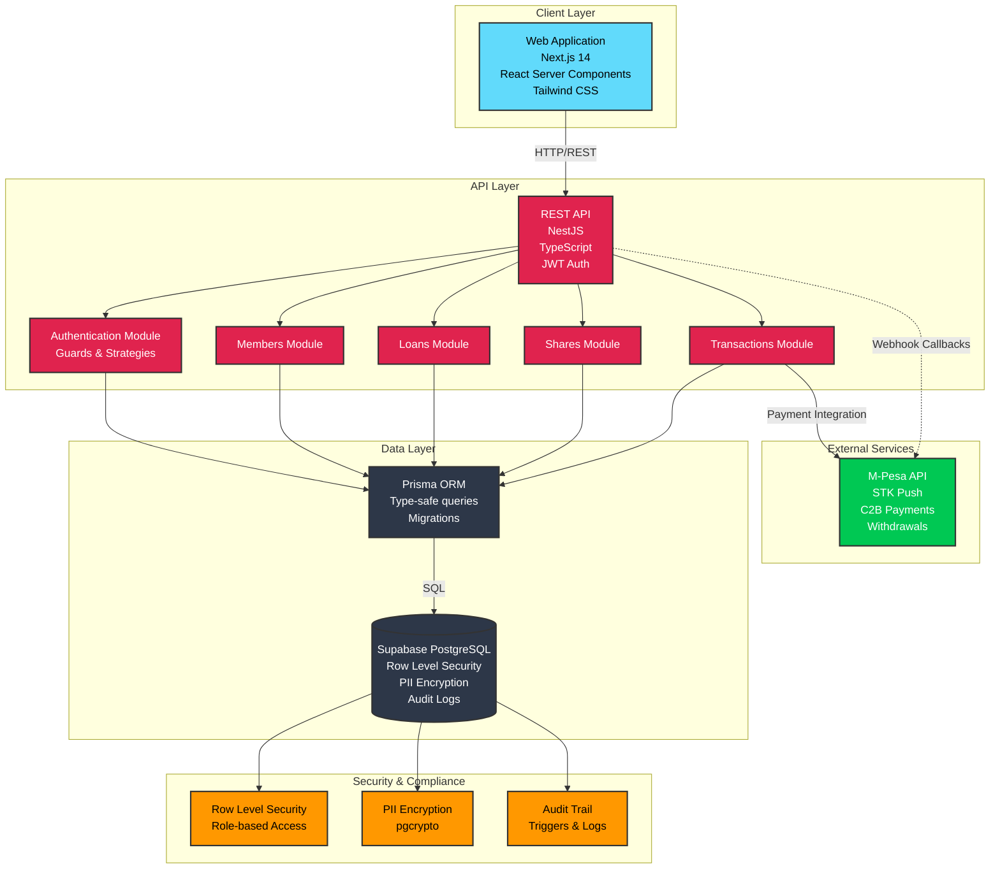
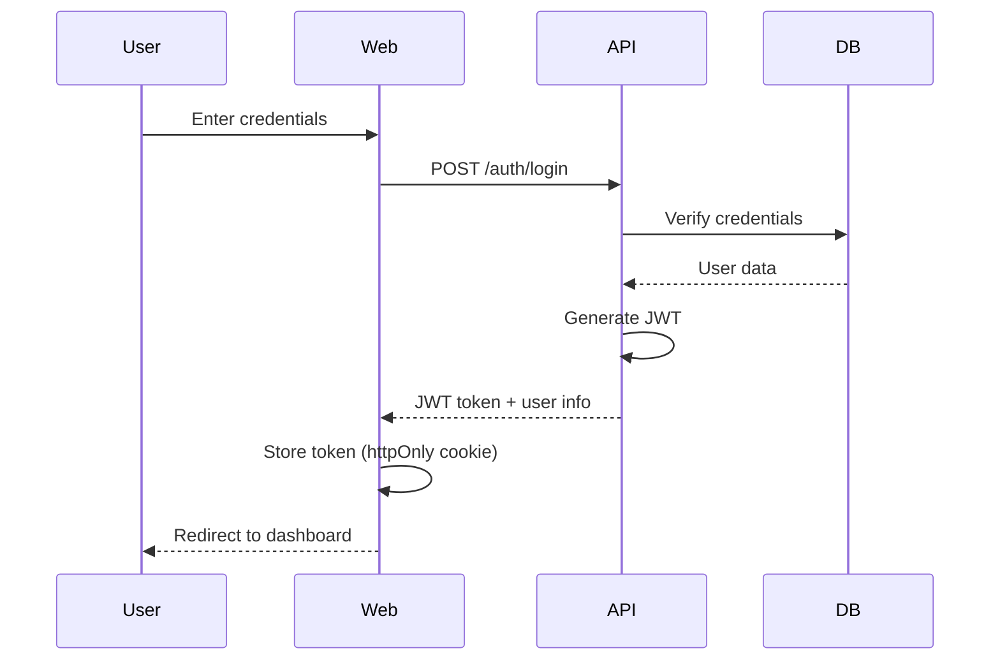
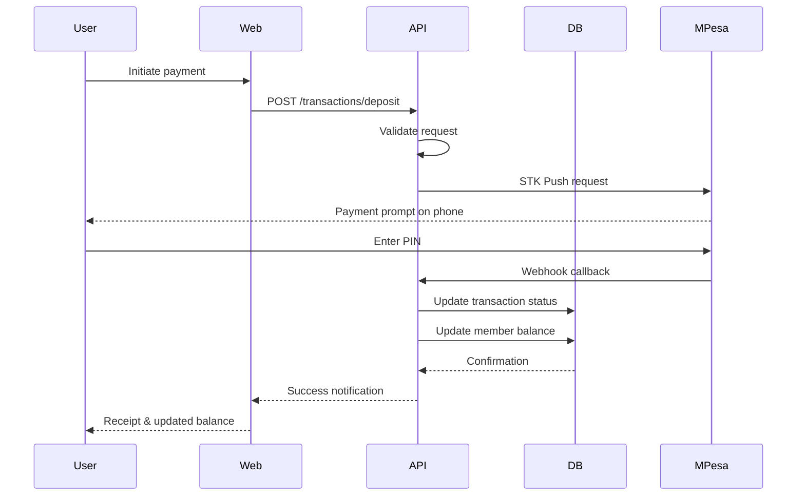
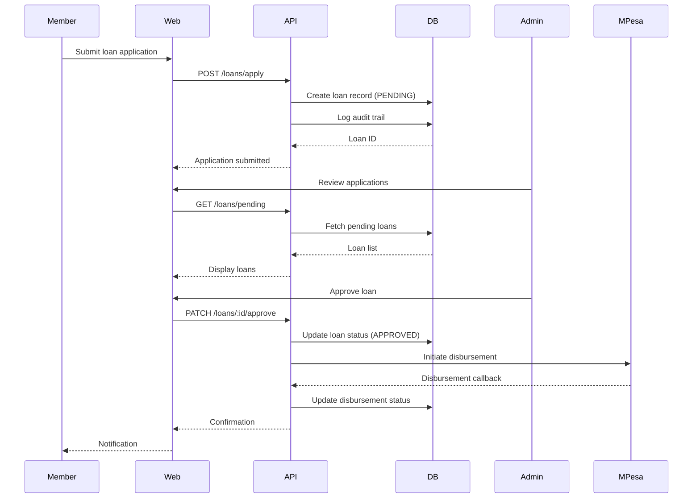
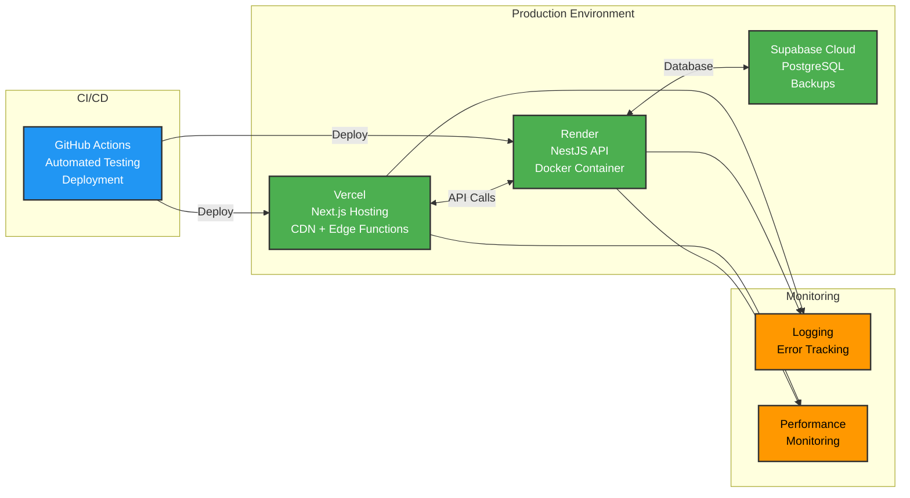
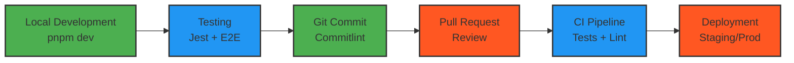

# System Architecture

## Overview

The Church SACCO Platform is a full-stack monorepo application designed to manage church savings and credit cooperative operations. The system follows a modern three-tier architecture with clear separation of concerns and robust security measures.

## Architecture Diagram



## Component Details

### 1. Client Layer (Web Application)

**Technology Stack:**
- **Framework:** Next.js 14 with App Router
- **UI Library:** React 18 with Server Components
- **Styling:** Tailwind CSS for responsive design
- **State Management:** React Context + Server Actions
- **Type Safety:** TypeScript

**Key Features:**
- Server-side rendering for optimal performance
- Progressive Web App (PWA) capabilities
- Responsive design for mobile and desktop
- Real-time updates via Server-Sent Events

**Location:** `apps/web/`

### 2. API Layer (Backend Services)

**Technology Stack:**
- **Framework:** NestJS (Node.js framework)
- **Language:** TypeScript
- **Authentication:** JWT + Passport.js
- **Validation:** class-validator, class-transformer
- **Documentation:** Swagger/OpenAPI

**Modules:**

#### Authentication Module
- JWT-based authentication
- Role-based access control (RBAC)
- Session management
- Password hashing with bcrypt

#### Members Module
- Member registration and profile management
- KYC verification
- Member search and filtering
- PII data handling

#### Loans Module
- Loan application processing
- Approval workflows
- Repayment tracking
- Interest calculation

#### Shares Module
- Share purchase and management
- Dividend calculations
- Share transfer handling

#### Transactions Module
- Payment processing
- Transaction history
- Receipt generation
- M-Pesa integration

**Location:** `apps/api/`

### 3. Data Layer

#### Prisma ORM
- Type-safe database queries
- Schema migrations
- Seed data management
- Query optimization

**Features:**
- Automatic TypeScript type generation
- Migration versioning
- Connection pooling
- Transaction support

#### Supabase PostgreSQL
- Hosted PostgreSQL database
- Real-time subscriptions
- Automatic API generation
- Built-in authentication

**Location:** `db/`

### 4. External Services

#### M-Pesa Integration

**Capabilities:**
- **STK Push:** Initiate payment requests to user phones
- **C2B Payments:** Receive customer-to-business payments
- **B2C Withdrawals:** Disburse loan amounts and dividends
- **Transaction Queries:** Check payment status
- **Webhook Callbacks:** Handle payment confirmations

**Implementation:**
- Secure API key management
- Retry mechanisms for failed transactions
- Transaction reconciliation
- Callback URL validation

### 5. Security & Compliance

#### Row Level Security (RLS)
- Database-level access control
- User role enforcement
- Multi-tenancy support
- Query-level filtering

**Policies:**
```sql
-- Example: Members can only view their own records
CREATE POLICY member_read_own 
ON members FOR SELECT 
USING (auth.uid() = user_id);
```

#### PII Encryption
- Sensitive data encryption at rest
- pgcrypto extension
- Encrypted fields: phone numbers, ID numbers, bank accounts
- Secure key management

**Encrypted Fields:**
- Phone numbers
- National ID numbers
- Bank account numbers
- Postal addresses

#### Audit Trail
- Automatic logging of all data changes
- Trigger-based audit system
- Immutable audit logs
- Compliance reporting

**Tracked Events:**
- Member registrations
- Loan applications and approvals
- Financial transactions
- Profile updates
- Administrative actions

## Data Flow

### 1. User Authentication Flow



### 2. Transaction Processing Flow



### 3. Loan Application Flow



## Deployment Architecture



## Technology Stack Summary

| Layer | Technology | Purpose |
|-------|-----------|---------|
| **Frontend** | Next.js 14 | React framework with SSR |
| | React 18 | UI component library |
| | Tailwind CSS | Utility-first styling |
| | TypeScript | Type safety |
| **Backend** | NestJS | Node.js framework |
| | Passport.js | Authentication |
| | class-validator | Input validation |
| | TypeScript | Type safety |
| **Database** | PostgreSQL | Relational database |
| | Prisma | ORM and migrations |
| | Supabase | Database hosting |
| **Security** | JWT | Token-based auth |
| | bcrypt | Password hashing |
| | pgcrypto | PII encryption |
| | RLS | Row-level security |
| **External** | M-Pesa API | Payment processing |
| **DevOps** | pnpm | Package management |
| | Turborepo | Monorepo tooling |
| | Docker | Containerization |
| | GitHub Actions | CI/CD |

## Security Measures

### 1. Authentication & Authorization
- JWT tokens with expiration
- Role-based access control (Admin, Staff, Member)
- Secure password hashing
- Session management

### 2. Data Protection
- PII encryption at rest
- HTTPS/TLS in transit
- Row-level security policies
- Input validation and sanitization

### 3. Audit & Compliance
- Comprehensive audit logging
- Immutable audit trails
- Transaction tracking
- Compliance reporting

### 4. API Security
- Rate limiting
- CORS configuration
- Request validation
- SQL injection prevention

## Development Workflow



## Folder Structure

```
church-sacco-platform/
├── apps/
│   ├── web/              # Next.js frontend
│   │   ├── src/
│   │   │   ├── app/      # App router pages
│   │   │   └── lib/      # Utilities & hooks
│   │   └── package.json
│   └── api/              # NestJS backend
│       ├── src/
│       │   ├── auth/     # Authentication
│       │   ├── members/  # Members module
│       │   ├── loans/    # Loans module
│       │   └── main.ts   # Entry point
│       └── package.json
├── db/                   # Database management
│   ├── prisma/
│   │   ├── schema.prisma
│   │   └── migrations/
│   └── seeds/
├── packages/
│   └── config/           # Shared configs
│       ├── eslint-preset.js
│       ├── prettier.config.js
│       └── tsconfig.base.json
└── docs/                 # Documentation
    ├── architecture.md   # This file
    ├── 01-project-overview.md
    └── ...
```

## Performance Considerations

### Frontend Optimization
- Server-side rendering for faster initial loads
- Code splitting and lazy loading
- Image optimization
- Caching strategies

### Backend Optimization
- Database connection pooling
- Query optimization
- Response caching
- Efficient pagination

### Database Optimization
- Proper indexing
- Query performance monitoring
- Connection management
- Backup strategies

## Scalability

### Horizontal Scaling
- Stateless API design
- Load balancing ready
- Database read replicas
- CDN for static assets

### Vertical Scaling
- Efficient resource utilization
- Query optimization
- Caching layers
- Database performance tuning

## Future Enhancements

1. **Real-time Features**
   - WebSocket support for live updates
   - Push notifications
   - Real-time transaction monitoring

2. **Analytics Dashboard**
   - Business intelligence
   - Performance metrics
   - Financial reports

3. **Mobile App**
   - React Native application
   - Offline capabilities
   - Biometric authentication

4. **Additional Payment Gateways**
   - Bank integration
   - Card payments
   - Alternative payment methods

## Contributing

This architecture is designed to be maintainable and extensible. When contributing:

1. Follow the established patterns in each layer
2. Maintain type safety with TypeScript
3. Write tests for new features
4. Update documentation for architectural changes
5. Follow security best practices
6. Use conventional commits

## Resources

- [Next.js Documentation](https://nextjs.org/docs)
- [NestJS Documentation](https://docs.nestjs.com)
- [Prisma Documentation](https://www.prisma.io/docs)
- [Supabase Documentation](https://supabase.com/docs)
- [M-Pesa API Documentation](https://developer.safaricom.co.ke)

---

**Last Updated:** November 13, 2025  
**Version:** 1.0.0  
**Maintained By:** Church SACCO Platform Team
